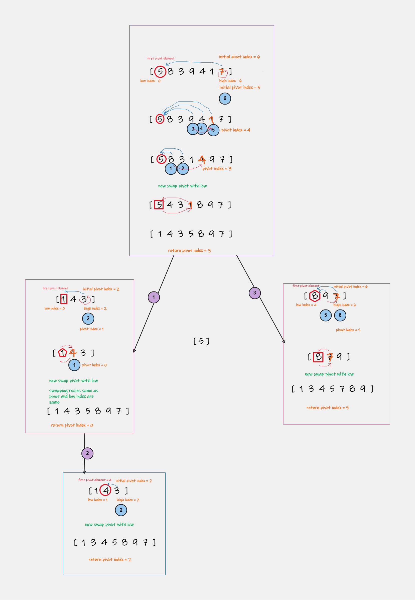
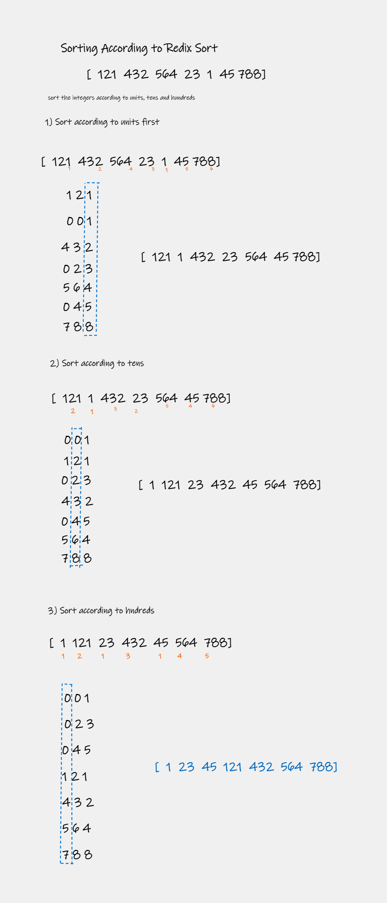

# Sorting Algorithms
Sorting algorithm is algorithm that rearranges given array/list in an order.

Benefits of sorting
- Searching for a value is faster in sorted array
- Can find duplicates easily
- Matching items in two or more file
- Can find median and top k values quickly
- 

## Sorting Terminology

### In-place Sorting
In-place algorithm uses constant space to sort order, it does not use any auxiliary space. 
It sorts only by modifying the order of the elements within given array/list.

**Example:**
- Insertion Sort
- Selection Sort

### Internal Sorting
When all the data is placed in the *main memory* or *internal memory* then sorting ic called Internal Sorting.

**Example**
- Heap Sort
- Bubble Sort
- Selection Sort
- Quick Sort
- Insertion Sort

### External Sorting
When all data that needs to be sorted cannot be placed in memory at a time, the sorting is called external sorting

**Example**
- Merge Sort

### Stable Sorting
Stability is mainly essential when we have key-value pairs with duplicate keys possible.

A sorting algorithm is stable when two objects with equal keys appear in the same order in sorted output as they appear in the input data set.

**Example**
- Bubble sort
- Insertion sort
- Merge sort
- Counting sort

### UnStable Sorting
When two same data appear in different order in sorted data then it is called as Unstable sort.

**Example**
- Quick sort
- Heap sort

## Complexities

## Sorting Algorithms

### Selection Sort
Sort by finding the smallest element and putting in the beginning and then repeat the process.
Sorting by repeated selection is "Selection Sort".
- Design Strategy - `Brute Force`
- Stability - Default implementation is `not stable`. However, it can be made stable. 
- `In Place` algorithm
- Time complexity - **Ω(n2)**, **Θ(n2)**, **O(n2)** 
- Space Complexity - O(1) As the only extra space is used for temporary variables while swapping

#### Pseudo Code and complexity 

#### Logic Execution

### Bubble Sort
Works by repeatedly swapping adjacent elements if they are not in correct order.

This algorithm is not suitable for large data sets as its average and worst-case time complexity is quite high.
- Design Strategy - `Brute Force`
- `Stable` algorithm
- `In Place` algorithm
- Time complexity - **Ω(n2)**, **Θ(n2)**, **O(n2)**
- Space Complexity - O(1) As the only extra space is used for temporary variables while swapping

#### Pseudo Code and complexity 

#### Logic Execution

### Insertion Sort

Array is split into sorted and unsorted array. Values from unsorted part are picked and placed at correct position in sorted array.
Values from the unsorted part are picked and placed at the correct position in the sorted part.
Works similar to the way you sort playing cards.

Efficient for small data set.

And it is appropriate for data sets which are already partially sorted.

- Design Strategy - `Decrease and conquer`
- `Stable` algorithm
- `In Place` algorithm
- Time Complexity -  `Ω(n)`, Θ(n2), O(n2)
- Space Complexity - `O(1)`

#### Pseudo Code and complexity

#### Logic Execution

### Merge Sort
Arrays in initially divided into two equal halves, and then they are combined in sorted array

Here array is recursively divided into two halves till the size becomes 1. 
Once size becomes 1 then it will merge back recursively till the complete array is merged.

Slower compared to the other sort algorithms for smaller tasks.

It goes through the whole process even if the array is sorted.

- Design Strategy - `Divide and conquer`
- `Stable` algorithm
- `NOT In Place` algorithm
- Time Complexity -  `Ω(n log(n))`, `Θ(n log(n))`, `O(n log(n))`
- space complexity - `O(n)`

#### Pseudo Code and complexity

#### Logic Execution

### Quick Sort
It picks an element as a pivot and partitions the given array around the picked pivot. 
There are many versions of quickSort that pick pivot in different ways.

- Always pick the first element as a pivot.
- Always pick the last element as a pivot 
- Pick a random element as a pivot.
- Pick median as the pivot.

The key process in quickSort is a partition(). 
After picking pivot keep smaller elements before pivot and larger after pivot.
Recursively follow this process.

- Design Strategy - `Divide and conquer`
- Time Complexity -  `Ω(n log(n))`, `Θ(n log(n))`, O(n2)
- space complexity - `O(n)` `O(log(n))`

### First Index Partition
#### Pseudo Code and complexity

#### Logic Execution

### Heap Sort
Convert the array ito heap data structure using heapify 
then one by one delete the root node of max heap and replace with last node.
Repeat this process.

- `In Place` algorithm
- Stability - Default implementation is `not stable`. However, it can be made stable.
- Time Complexity -  `Ω(n log(n))`, `Θ(n log(n))`, `O(n log(n))`
- Space Complexity - `O(1)`
- Typically, 2-3 times slower than well-implemented QuickSort.  The reason for slowness is a lack of locality of reference.
- The Merge sort is slightly faster than the Heap sort. But on the other hand merge sort takes extra memory. Depending on the requirement, one should choose which one to use.
- Better than Selection sort as it takes advantage of heap data structure to get maximum element in constant time.

#### Pseudo Code and complexity

#### Logic Execution

### Counting Sort
Sorts the elements of an array by counting the number of occurrences of each unique element in the array.
Count is stored in an auxiliary array.
And sorting is done by mapping the count as an index of auxiliary array.

- It makes some assumption about data that its values going to be in range o to 100 or 100 to 1000 etc.
- It is NOT comparison based algorithm 
- `NOT In Place` algorithm
- `Stable` Algorithm
- Time Complexity -  `Ω(n+k)`, `Θ(n+k)`, `O(n+2)`
- Space Complexity - `O(k)`
- Counting sort is used when there are smaller integers with duplicates (multiple counts) linear complexity is needed

#### Pseudo Code and complexity

#### Logic Execution

### Radix Sort
It sorts elements by grouping the individual digits of the same place value.
And sort elements according to their increasing/decreasing order.

The idea od radix sort is to do digit by digit sort starting from the least significant digit to most significant digit.
Radix sort uses counting sort as a subroutine to sort.

- It is NOT comparison based algorithm
- `NOT In Place` algorithm
- `Stable` Algorithm
- Time Complexity -  `Ω(n+k)`, `Θ(n+k)`, `O(n+2)`
- Space Complexity - `O(k)`
- Radix sort has linear time complexity which is better than `O(nlog n)` of comparative sorting algorithms.
- Radix sort is space inefficient. This is the reason why this sort is not used in software libraries.
- Radix sort is implemented in
  - DC3 Algorithm
  - places where numbers are in large ranges

