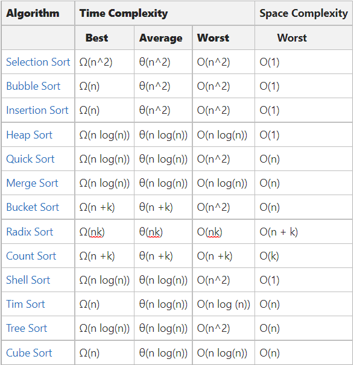
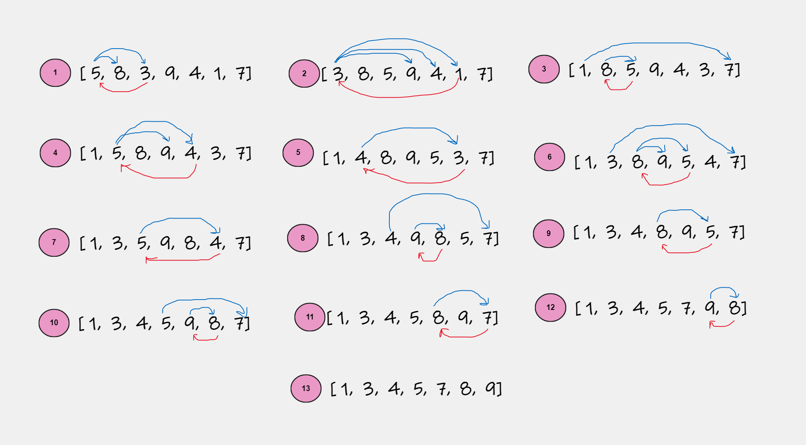

# Sorting Algorithms
Sorting algorithm is algorithm that rearranges given array/list in an order.

## Sorting Terminology

### In-place Sorting
In-place algorithm uses constant space to sort order, it does not use any auxiliary space. 
It sorts only by modifying the order of the elements within given array/list.

**Example:**
- Insertion Sort
- Selection Sort

### Internal Sorting
When all the data is placed in the *main memory* or *internal memory* then sorting ic called Internal Sorting.

**Example**
- Heap Sort
- Bubble Sort
- Selection Sort
- Quick Sort
- Insertion Sort

### External Sorting
When all data that needs to be sorted cannot be placed in memory at a time, the sorting is called external sorting

**Example**
- Merge Sort

### Stable Sorting
Stability is mainly essential when we have key-value pairs with duplicate keys possible.

A sorting algorithm is stable when two objects with equal keys appear in the same order in sorted output as they appear in the input data set.

**Example**
- Bubble sort
- Insertion sort
- Merge sort
- Counting sort

### UnStable Sorting
When two same data appear in different order in sorted data then it is called as Unstable sort.

**Example**
- Quick sort
- Heap sort

## Complexities

## Sorting Algorithms

### Selection Sort
Sort by finding the smallest element and putting in the beginning and then repeat the process.
Sorting by repeated selection is "Selection Sort".
- Design Strategy - `Brute Force`
- Stability - Default implementation is `not stable`. However, it can be made stable. 
- Time complexity - **Ω(n2)**, **Θ(n2)**, **O(n2)** 

#### Pseudo Code and complexity 

#### Logic Execution

